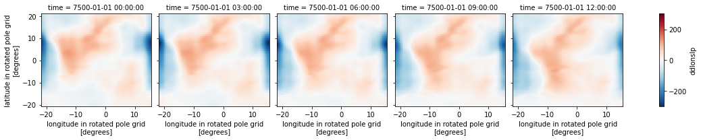

# Dynamics of Regional Climate Systems (DRCS) - Tools
> For data analysis


- Stormtracks
    * Follow Benestad et al. (2006)

## Install

`pip install drcstools`

## How to use

Usecase + concept

```python
from drcstools.storm import *
from drcstools.derivative import *

import xarray as xr
import numpy as np
import matplotlib.pyplot as plt
```

### Harmonic regression

Starting with the SLP at time step 1 and at Latitude 0°N

```python
ds = xr.open_dataset("data/rca_unrot_data_1_5.nc", use_cftime = True)
ds = ds.rename({"rlon":"lon", "rlat":"lat"})
data = ds.sel(lat=-20, method="nearest").slp.isel(time = 1)
data = data - data.mean()
data.plot()
```


    [<matplotlib.lines.Line2D at 0x7f24734f9dc0>]


Calculate N Fourier coefficents

```python
N = 20 # Number of harmonics
result = []
T = len(data)
t = np.arange(T)
for n in range(N+1):
    an = 2/T*(data * np.cos(2*np.pi*n*t/T)).sum()
    bn = 2/T*(data * np.sin(2*np.pi*n*t/T)).sum()
    result.append((an, bn))
anbn = np.array(result)
```

```python
plt.subplot(121); plt.stem(anbn[:,0], use_line_collection=True)
plt.subplot(122); plt.stem(anbn[:,1], use_line_collection=True)
```


    <StemContainer object of 3 artists>


Reconstruct the signal.

```python
result = 0
T = len(data)
t = np.arange(T)/T
for n, (a, b) in enumerate(anbn):
    if n == 0:
        a = a/2
    result = result + a*np.cos(2*np.pi*n*t) + b * np.sin(2*np.pi*n*t)
```

```python
plt.plot(data, label='Original', lw=2)
plt.plot(result, label='Reconstructed with {} Harmonics'.format(N))
plt.legend()
```


    <matplotlib.legend.Legend at 0x7f24733e7a30>


This fit can then be differentiated.

```python
Wi = 2 * np.pi / len(data)
t = np.arange(len(data))

an, bn = anbn[:,0], anbn[:,1]

dp = 0
for i in range(0, N):
    dp = dp + (Wi * (-an[i]*np.sin(Wi*i*t)+bn[i]*np.cos(Wi*i*t)))
    
zero_crossings = np.where(np.diff(np.signbit(dp)))[0] # Zero crossing of first derivative
```

```python
f, (ax, bx) = plt.subplots(2,1)

bx.plot(dp, label = "dp/dlon")
for point in zero_crossings:
    bx.axvline(x = point, color = "black")
    
ax.plot(result, label = "p")

for point in zero_crossings:
    ax.axvline(x = point, color = "black")

ax.legend(); bx.legend()
```


    <matplotlib.legend.Legend at 0x7f2473374670>


### Repeat with storm object

```python
obj = storm(ds = ds)
obj.set_up(force = True)
```

    WARNING: No regular grid found for dimension lon.
                Hint: use set_up(force=True).
    WARNING: force=True: using mean of non-equidistant grid [0.44 0.44 0.44 0.44]
    WARNING: No regular grid found for dimension lat.
                Hint: use set_up(force=True).
    WARNING: force=True: using mean of non-equidistant grid [0.44 0.44 0.44 0.44]
    INFO: 
     time: 'time'
     longitude: 'lon'
     latitude: 'lat'
    


```python
obj.derivative("slp", N = 10, dim = "lon") 
```

     60%|██████    | 3/5 [00:00<00:00, 24.43it/s]

    Calculating d/dlon for all time, lat points ...


    100%|██████████| 5/5 [00:00<00:00, 24.02it/s]


```python
f, (ax, bx) = plt.subplots(2,1)

bx.plot(obj.ds.isel(time = 1).sel(lat = -20, method = "nearest").slp, label = "dp/dlon")
for point in zero_crossings:
    bx.axvline(x = point, color = "black")
    
ax.plot(obj.ds.isel(time = 1).sel(lat = -20, method = "nearest").ddlonslp, label = "p")

for point in zero_crossings:
    ax.axvline(x = point, color = "black")

ax.legend(); bx.legend()
```


    <matplotlib.legend.Legend at 0x7f24732dd520>


## Apply to 2D SLP data

> we need a grid without NaN values

```python
obj = storm(ds = ds)
obj.set_up(force = True)
```

    WARNING: No regular grid found for dimension lon.
                Hint: use set_up(force=True).
    WARNING: force=True: using mean of non-equidistant grid [0.44 0.44 0.44 0.44]
    WARNING: No regular grid found for dimension lat.
                Hint: use set_up(force=True).
    WARNING: force=True: using mean of non-equidistant grid [0.44 0.44 0.44 0.44]
    INFO: 
     time: 'time'
     longitude: 'lon'
     latitude: 'lat'
    


```python
obj._derivative("slp", N = 10, dim = "lon") 
obj._derivative("slp", N = 10, dim = "lon", order = 2) # 2nd derivative 
```

     40%|████      | 2/5 [00:00<00:00, 17.14it/s]

    Calculating d/dlon for all time, lat points ...


    100%|██████████| 5/5 [00:00<00:00, 16.44it/s]
    100%|██████████| 5/5 [00:00<00:00, 25.34it/s]

    Calculating d/dlon for all time, lat points ...


    


```python
obj.ds
```


<div><svg style="position: absolute; width: 0; height: 0; overflow: hidden">
<defs>
<symbol id="icon-database" viewBox="0 0 32 32">
<title>Show/Hide data repr</title>
<path d="M16 0c-8.837 0-16 2.239-16 5v4c0 2.761 7.163 5 16 5s16-2.239 16-5v-4c0-2.761-7.163-5-16-5z"></path>
<path d="M16 17c-8.837 0-16-2.239-16-5v6c0 2.761 7.163 5 16 5s16-2.239 16-5v-6c0 2.761-7.163 5-16 5z"></path>
<path d="M16 26c-8.837 0-16-2.239-16-5v6c0 2.761 7.163 5 16 5s16-2.239 16-5v-6c0 2.761-7.163 5-16 5z"></path>
</symbol>
<symbol id="icon-file-text2" viewBox="0 0 32 32">
<title>Show/Hide attributes</title>
<path d="M28.681 7.159c-0.694-0.947-1.662-2.053-2.724-3.116s-2.169-2.030-3.116-2.724c-1.612-1.182-2.393-1.319-2.841-1.319h-15.5c-1.378 0-2.5 1.121-2.5 2.5v27c0 1.378 1.122 2.5 2.5 2.5h23c1.378 0 2.5-1.122 2.5-2.5v-19.5c0-0.448-0.137-1.23-1.319-2.841zM24.543 5.457c0.959 0.959 1.712 1.825 2.268 2.543h-4.811v-4.811c0.718 0.556 1.584 1.309 2.543 2.268zM28 29.5c0 0.271-0.229 0.5-0.5 0.5h-23c-0.271 0-0.5-0.229-0.5-0.5v-27c0-0.271 0.229-0.5 0.5-0.5 0 0 15.499-0 15.5 0v7c0 0.552 0.448 1 1 1h7v19.5z"></path>
<path d="M23 26h-14c-0.552 0-1-0.448-1-1s0.448-1 1-1h14c0.552 0 1 0.448 1 1s-0.448 1-1 1z"></path>
<path d="M23 22h-14c-0.552 0-1-0.448-1-1s0.448-1 1-1h14c0.552 0 1 0.448 1 1s-0.448 1-1 1z"></path>
<path d="M23 18h-14c-0.552 0-1-0.448-1-1s0.448-1 1-1h14c0.552 0 1 0.448 1 1s-0.448 1-1 1z"></path>
</symbol>
</defs>
</svg>
<style>/* CSS stylesheet for displaying xarray objects in jupyterlab.
 *
 */

:root {
  --xr-font-color0: var(--jp-content-font-color0, rgba(0, 0, 0, 1));
  --xr-font-color2: var(--jp-content-font-color2, rgba(0, 0, 0, 0.54));
  --xr-font-color3: var(--jp-content-font-color3, rgba(0, 0, 0, 0.38));
  --xr-border-color: var(--jp-border-color2, #e0e0e0);
  --xr-disabled-color: var(--jp-layout-color3, #bdbdbd);
  --xr-background-color: var(--jp-layout-color0, white);
  --xr-background-color-row-even: var(--jp-layout-color1, white);
  --xr-background-color-row-odd: var(--jp-layout-color2, #eeeeee);
}

.xr-wrap {
  min-width: 300px;
  max-width: 700px;
}

.xr-header {
  padding-top: 6px;
  padding-bottom: 6px;
  margin-bottom: 4px;
  border-bottom: solid 1px var(--xr-border-color);
}

.xr-header > div,
.xr-header > ul {
  display: inline;
  margin-top: 0;
  margin-bottom: 0;
}

.xr-obj-type,
.xr-array-name {
  margin-left: 2px;
  margin-right: 10px;
}

.xr-obj-type {
  color: var(--xr-font-color2);
}

.xr-sections {
  padding-left: 0 !important;
  display: grid;
  grid-template-columns: 150px auto auto 1fr 20px 20px;
}

.xr-section-item {
  display: contents;
}

.xr-section-item input {
  display: none;
}

.xr-section-item input + label {
  color: var(--xr-disabled-color);
}

.xr-section-item input:enabled + label {
  cursor: pointer;
  color: var(--xr-font-color2);
}

.xr-section-item input:enabled + label:hover {
  color: var(--xr-font-color0);
}

.xr-section-summary {
  grid-column: 1;
  color: var(--xr-font-color2);
  font-weight: 500;
}

.xr-section-summary > span {
  display: inline-block;
  padding-left: 0.5em;
}

.xr-section-summary-in:disabled + label {
  color: var(--xr-font-color2);
}

.xr-section-summary-in + label:before {
  display: inline-block;
  content: '►';
  font-size: 11px;
  width: 15px;
  text-align: center;
}

.xr-section-summary-in:disabled + label:before {
  color: var(--xr-disabled-color);
}

.xr-section-summary-in:checked + label:before {
  content: '▼';
}

.xr-section-summary-in:checked + label > span {
  display: none;
}

.xr-section-summary,
.xr-section-inline-details {
  padding-top: 4px;
  padding-bottom: 4px;
}

.xr-section-inline-details {
  grid-column: 2 / -1;
}

.xr-section-details {
  display: none;
  grid-column: 1 / -1;
  margin-bottom: 5px;
}

.xr-section-summary-in:checked ~ .xr-section-details {
  display: contents;
}

.xr-array-wrap {
  grid-column: 1 / -1;
  display: grid;
  grid-template-columns: 20px auto;
}

.xr-array-wrap > label {
  grid-column: 1;
  vertical-align: top;
}

.xr-preview {
  color: var(--xr-font-color3);
}

.xr-array-preview,
.xr-array-data {
  padding: 0 5px !important;
  grid-column: 2;
}

.xr-array-data,
.xr-array-in:checked ~ .xr-array-preview {
  display: none;
}

.xr-array-in:checked ~ .xr-array-data,
.xr-array-preview {
  display: inline-block;
}

.xr-dim-list {
  display: inline-block !important;
  list-style: none;
  padding: 0 !important;
  margin: 0;
}

.xr-dim-list li {
  display: inline-block;
  padding: 0;
  margin: 0;
}

.xr-dim-list:before {
  content: '(';
}

.xr-dim-list:after {
  content: ')';
}

.xr-dim-list li:not(:last-child):after {
  content: ',';
  padding-right: 5px;
}

.xr-has-index {
  font-weight: bold;
}

.xr-var-list,
.xr-var-item {
  display: contents;
}

.xr-var-item > div,
.xr-var-item label,
.xr-var-item > .xr-var-name span {
  background-color: var(--xr-background-color-row-even);
  margin-bottom: 0;
}

.xr-var-item > .xr-var-name:hover span {
  padding-right: 5px;
}

.xr-var-list > li:nth-child(odd) > div,
.xr-var-list > li:nth-child(odd) > label,
.xr-var-list > li:nth-child(odd) > .xr-var-name span {
  background-color: var(--xr-background-color-row-odd);
}

.xr-var-name {
  grid-column: 1;
}

.xr-var-dims {
  grid-column: 2;
}

.xr-var-dtype {
  grid-column: 3;
  text-align: right;
  color: var(--xr-font-color2);
}

.xr-var-preview {
  grid-column: 4;
}

.xr-var-name,
.xr-var-dims,
.xr-var-dtype,
.xr-preview,
.xr-attrs dt {
  white-space: nowrap;
  overflow: hidden;
  text-overflow: ellipsis;
  padding-right: 10px;
}

.xr-var-name:hover,
.xr-var-dims:hover,
.xr-var-dtype:hover,
.xr-attrs dt:hover {
  overflow: visible;
  width: auto;
  z-index: 1;
}

.xr-var-attrs,
.xr-var-data {
  display: none;
  background-color: var(--xr-background-color) !important;
  padding-bottom: 5px !important;
}

.xr-var-attrs-in:checked ~ .xr-var-attrs,
.xr-var-data-in:checked ~ .xr-var-data {
  display: block;
}

.xr-var-data > table {
  float: right;
}

.xr-var-name span,
.xr-var-data,
.xr-attrs {
  padding-left: 25px !important;
}

.xr-attrs,
.xr-var-attrs,
.xr-var-data {
  grid-column: 1 / -1;
}

dl.xr-attrs {
  padding: 0;
  margin: 0;
  display: grid;
  grid-template-columns: 125px auto;
}

.xr-attrs dt, dd {
  padding: 0;
  margin: 0;
  float: left;
  padding-right: 10px;
  width: auto;
}

.xr-attrs dt {
  font-weight: normal;
  grid-column: 1;
}

.xr-attrs dt:hover span {
  display: inline-block;
  background: var(--xr-background-color);
  padding-right: 10px;
}

.xr-attrs dd {
  grid-column: 2;
  white-space: pre-wrap;
  word-break: break-all;
}

.xr-icon-database,
.xr-icon-file-text2 {
  display: inline-block;
  vertical-align: middle;
  width: 1em;
  height: 1.5em !important;
  stroke-width: 0;
  stroke: currentColor;
  fill: currentColor;
}
</style><div class='xr-wrap'><div class='xr-header'><div class='xr-obj-type'>xarray.Dataset</div></div><ul class='xr-sections'><li class='xr-section-item'><input id='section-2241a3b6-1cb3-4b97-802e-091d49676e92' class='xr-section-summary-in' type='checkbox' disabled ><label for='section-2241a3b6-1cb3-4b97-802e-091d49676e92' class='xr-section-summary'  title='Expand/collapse section'>Dimensions:</label><div class='xr-section-inline-details'><ul class='xr-dim-list'><li><span class='xr-has-index'>lat</span>: 95</li><li><span class='xr-has-index'>lon</span>: 85</li><li><span class='xr-has-index'>time</span>: 5</li></ul></div><div class='xr-section-details'></div></li><li class='xr-section-item'><input id='section-2377e930-b74f-416a-8b73-787f42586b6c' class='xr-section-summary-in' type='checkbox'  checked><label for='section-2377e930-b74f-416a-8b73-787f42586b6c' class='xr-section-summary' >Coordinates: <span>(3)</span></label><div class='xr-section-inline-details'></div><div class='xr-section-details'><ul class='xr-var-list'><li class='xr-var-item'><div class='xr-var-name'><span class='xr-has-index'>time</span></div><div class='xr-var-dims'>(time)</div><div class='xr-var-dtype'>object</div><div class='xr-var-preview xr-preview'>7500-01-01 00:00:00 ... 7500-01-01 12:00:00</div><input id='attrs-0e253cf5-4767-4c40-9640-492dff35bac2' class='xr-var-attrs-in' type='checkbox' ><label for='attrs-0e253cf5-4767-4c40-9640-492dff35bac2' title='Show/Hide attributes'><svg class='icon xr-icon-file-text2'><use xlink:href='#icon-file-text2'></use></svg></label><input id='data-4f70beb0-f69d-48da-805c-0f8a52455b54' class='xr-var-data-in' type='checkbox'><label for='data-4f70beb0-f69d-48da-805c-0f8a52455b54' title='Show/Hide data repr'><svg class='icon xr-icon-database'><use xlink:href='#icon-database'></use></svg></label><div class='xr-var-attrs'><dl class='xr-attrs'><dt><span>standard_name :</span></dt><dd>time</dd><dt><span>axis :</span></dt><dd>T</dd></dl></div><pre class='xr-var-data'>array([cftime.DatetimeProlepticGregorian(7500-01-01 00:00:00),
       cftime.DatetimeProlepticGregorian(7500-01-01 03:00:00),
       cftime.DatetimeProlepticGregorian(7500-01-01 06:00:00),
       cftime.DatetimeProlepticGregorian(7500-01-01 09:00:00),
       cftime.DatetimeProlepticGregorian(7500-01-01 12:00:00)], dtype=object)</pre></li><li class='xr-var-item'><div class='xr-var-name'><span class='xr-has-index'>lon</span></div><div class='xr-var-dims'>(lon)</div><div class='xr-var-dtype'>float64</div><div class='xr-var-preview xr-preview'>-21.61 -21.17 ... 14.91 15.35</div><input id='attrs-0c99450a-785c-4e28-87f8-7e691f4a6151' class='xr-var-attrs-in' type='checkbox' ><label for='attrs-0c99450a-785c-4e28-87f8-7e691f4a6151' title='Show/Hide attributes'><svg class='icon xr-icon-file-text2'><use xlink:href='#icon-file-text2'></use></svg></label><input id='data-56b71d80-a663-4337-9bb3-49d7b21b83a6' class='xr-var-data-in' type='checkbox'><label for='data-56b71d80-a663-4337-9bb3-49d7b21b83a6' title='Show/Hide data repr'><svg class='icon xr-icon-database'><use xlink:href='#icon-database'></use></svg></label><div class='xr-var-attrs'><dl class='xr-attrs'><dt><span>standard_name :</span></dt><dd>longitude</dd><dt><span>long_name :</span></dt><dd>longitude in rotated pole grid</dd><dt><span>units :</span></dt><dd>degrees</dd><dt><span>axis :</span></dt><dd>X</dd></dl></div><pre class='xr-var-data'>array([-21.61, -21.17, -20.73, -20.29, -19.85, -19.41, -18.97, -18.53, -18.09,
       -17.65, -17.21, -16.77, -16.33, -15.89, -15.45, -15.01, -14.57, -14.13,
       -13.69, -13.25, -12.81, -12.37, -11.93, -11.49, -11.05, -10.61, -10.17,
        -9.73,  -9.29,  -8.85,  -8.41,  -7.97,  -7.53,  -7.09,  -6.65,  -6.21,
        -5.77,  -5.33,  -4.89,  -4.45,  -4.01,  -3.57,  -3.13,  -2.69,  -2.25,
        -1.81,  -1.37,  -0.93,  -0.49,  -0.05,   0.39,   0.83,   1.27,   1.71,
         2.15,   2.59,   3.03,   3.47,   3.91,   4.35,   4.79,   5.23,   5.67,
         6.11,   6.55,   6.99,   7.43,   7.87,   8.31,   8.75,   9.19,   9.63,
        10.07,  10.51,  10.95,  11.39,  11.83,  12.27,  12.71,  13.15,  13.59,
        14.03,  14.47,  14.91,  15.35])</pre></li><li class='xr-var-item'><div class='xr-var-name'><span class='xr-has-index'>lat</span></div><div class='xr-var-dims'>(lat)</div><div class='xr-var-dtype'>float64</div><div class='xr-var-preview xr-preview'>-20.57 -20.13 ... 20.35 20.79</div><input id='attrs-c4e65458-a7b5-4b75-a958-f3cecf907d8b' class='xr-var-attrs-in' type='checkbox' ><label for='attrs-c4e65458-a7b5-4b75-a958-f3cecf907d8b' title='Show/Hide attributes'><svg class='icon xr-icon-file-text2'><use xlink:href='#icon-file-text2'></use></svg></label><input id='data-9c0b6de9-9afc-4a97-acfc-4cb8987db15b' class='xr-var-data-in' type='checkbox'><label for='data-9c0b6de9-9afc-4a97-acfc-4cb8987db15b' title='Show/Hide data repr'><svg class='icon xr-icon-database'><use xlink:href='#icon-database'></use></svg></label><div class='xr-var-attrs'><dl class='xr-attrs'><dt><span>standard_name :</span></dt><dd>latitude</dd><dt><span>long_name :</span></dt><dd>latitude in rotated pole grid</dd><dt><span>units :</span></dt><dd>degrees</dd><dt><span>axis :</span></dt><dd>Y</dd></dl></div><pre class='xr-var-data'>array([-20.57, -20.13, -19.69, -19.25, -18.81, -18.37, -17.93, -17.49, -17.05,
       -16.61, -16.17, -15.73, -15.29, -14.85, -14.41, -13.97, -13.53, -13.09,
       -12.65, -12.21, -11.77, -11.33, -10.89, -10.45, -10.01,  -9.57,  -9.13,
        -8.69,  -8.25,  -7.81,  -7.37,  -6.93,  -6.49,  -6.05,  -5.61,  -5.17,
        -4.73,  -4.29,  -3.85,  -3.41,  -2.97,  -2.53,  -2.09,  -1.65,  -1.21,
        -0.77,  -0.33,   0.11,   0.55,   0.99,   1.43,   1.87,   2.31,   2.75,
         3.19,   3.63,   4.07,   4.51,   4.95,   5.39,   5.83,   6.27,   6.71,
         7.15,   7.59,   8.03,   8.47,   8.91,   9.35,   9.79,  10.23,  10.67,
        11.11,  11.55,  11.99,  12.43,  12.87,  13.31,  13.75,  14.19,  14.63,
        15.07,  15.51,  15.95,  16.39,  16.83,  17.27,  17.71,  18.15,  18.59,
        19.03,  19.47,  19.91,  20.35,  20.79])</pre></li></ul></div></li><li class='xr-section-item'><input id='section-b37faed2-f93e-4513-a635-ef113ec5730e' class='xr-section-summary-in' type='checkbox'  checked><label for='section-b37faed2-f93e-4513-a635-ef113ec5730e' class='xr-section-summary' >Data variables: <span>(3)</span></label><div class='xr-section-inline-details'></div><div class='xr-section-details'><ul class='xr-var-list'><li class='xr-var-item'><div class='xr-var-name'><span>slp</span></div><div class='xr-var-dims'>(time, lat, lon)</div><div class='xr-var-dtype'>float32</div><div class='xr-var-preview xr-preview'>102554.56 102556.56 ... 102995.25</div><input id='attrs-15985e99-c519-48ad-b1bb-b29601288d3b' class='xr-var-attrs-in' type='checkbox' ><label for='attrs-15985e99-c519-48ad-b1bb-b29601288d3b' title='Show/Hide attributes'><svg class='icon xr-icon-file-text2'><use xlink:href='#icon-file-text2'></use></svg></label><input id='data-4339afad-ea61-4bed-baaa-e8a308ef7c26' class='xr-var-data-in' type='checkbox'><label for='data-4339afad-ea61-4bed-baaa-e8a308ef7c26' title='Show/Hide data repr'><svg class='icon xr-icon-database'><use xlink:href='#icon-database'></use></svg></label><div class='xr-var-attrs'><dl class='xr-attrs'><dt><span>table :</span></dt><dd>1</dd></dl></div><pre class='xr-var-data'>array([[[102554.56, 102556.56, ..., 102230.56, 102230.56],
        [102560.56, 102560.56, ..., 102244.56, 102246.56],
        ...,
        [101784.56, 101820.56, ..., 102954.56, 102982.56],
        [101798.56, 101838.56, ..., 102912.56, 102940.56]],

       [[102551.31, 102551.31, ..., 102237.31, 102235.31],
        [102555.31, 102555.31, ..., 102245.31, 102243.31],
        ...,
        [101817.31, 101847.31, ..., 102931.31, 102961.31],
        [101813.31, 101845.31, ..., 102907.31, 102935.31]],

       ...,

       [[102464.31, 102458.31, ..., 102190.31, 102188.31],
        [102458.31, 102452.31, ..., 102178.31, 102180.31],
        ...,
        [101874.31, 101888.31, ..., 102932.31, 102970.31],
        [101858.31, 101872.31, ..., 102926.31, 102962.31]],

       [[102313.25, 102297.25, ..., 102163.25, 102169.25],
        [102307.25, 102291.25, ..., 102147.25, 102149.25],
        ...,
        [101895.25, 101897.25, ..., 102961.25, 103001.25],
        [101875.25, 101877.25, ..., 102955.25, 102995.25]]], dtype=float32)</pre></li><li class='xr-var-item'><div class='xr-var-name'><span>ddlonslp</span></div><div class='xr-var-dims'>(time, lat, lon)</div><div class='xr-var-dtype'>float64</div><div class='xr-var-preview xr-preview'>25.99 23.4 19.21 ... -58.7 -70.46</div><input id='attrs-948e7e51-6e2e-45eb-b70b-a9247a37b023' class='xr-var-attrs-in' type='checkbox' disabled><label for='attrs-948e7e51-6e2e-45eb-b70b-a9247a37b023' title='Show/Hide attributes'><svg class='icon xr-icon-file-text2'><use xlink:href='#icon-file-text2'></use></svg></label><input id='data-d3f1d5f9-a93f-480a-be96-b109c4a46908' class='xr-var-data-in' type='checkbox'><label for='data-d3f1d5f9-a93f-480a-be96-b109c4a46908' title='Show/Hide data repr'><svg class='icon xr-icon-database'><use xlink:href='#icon-database'></use></svg></label><div class='xr-var-attrs'><dl class='xr-attrs'></dl></div><pre class='xr-var-data'>array([[[ 25.9859848 ,  23.3961792 ,  19.20761681, ...,  21.44711113,
          24.77444839,  26.45245552],
        [ 25.41526031,  22.91013718,  18.88613701, ...,  20.98303032,
          24.24075127,  25.87340736],
        [ 23.86294556,  21.5746479 ,  17.90128708, ...,  19.89123726,
          22.82623863,  24.29210663],
        ...,
        [-78.5703125 , -74.73098755, -65.70204926, ..., -49.21406174,
         -65.09558868, -75.4078598 ],
        [-73.95143127, -70.3287735 , -61.73062897, ..., -45.63194275,
         -60.89556885, -70.84994507],
        [-67.53585052, -64.28848267, -56.24617386, ..., -40.05302048,
         -54.67225266, -64.34944153]],

       [[ 25.67630959,  23.04787636,  18.97451973, ...,  21.94529343,
          24.94154549,  26.32817268],
        [ 25.10901451,  22.5489006 ,  18.6182251 , ...,  21.38711739,
          24.37575912,  25.74928856],
        [ 23.86717033,  21.46611214,  17.76423073, ...,  20.23814011,
          23.10027504,  24.44042969],
        ...,
        [-75.32336426, -72.28997803, -64.4646225 , ..., -46.5610466 ,
         -61.80918503, -71.88040161],
        [-73.23444366, -70.23692322, -62.48619461, ..., -44.9313736 ,
         -59.90431595, -69.82897186],
        [-69.5789566 , -66.75824738, -59.18091965, ..., -41.48754883,
         -56.18975449, -66.06602478]],

       [[ 20.68391037,  18.18761826,  14.41146278, ...,  17.85741043,
          20.36006355,  21.42707825],
        [ 19.76455498,  17.34557343,  13.7165308 , ...,  16.96377373,
          19.44005966,  20.48984146],
        [ 18.39715576,  16.18729782,  12.7925272 , ...,  15.44608212,
          17.86904144,  18.97448349],
        ...,
        [-72.89498138, -70.70709229, -63.90449905, ..., -43.62425995,
         -58.69235992, -68.92152405],
        [-72.02648163, -69.77852631, -62.86435318, ..., -42.88614273,
         -57.87483597, -68.07640839],
        [-69.85099792, -67.70072937, -60.78704071, ..., -40.55729675,
         -55.47742081, -65.76264954]],

       [[ 16.599226  ,  14.47728634,  11.14720249, ...,  13.55113029,
          15.96219063,  17.10160255],
        [ 15.46457863,  13.62723255,  10.54180431, ...,  11.80273151,
          14.33307934,  15.69041348],
        [ 14.12795067,  12.50259495,   9.59583569, ...,  10.07979584,
          12.64609432,  14.14884186],
        ...,
        [-73.45271301, -71.98564911, -65.90465546, ..., -42.96648026,
         -58.22674561, -68.87112427],
        [-73.570755  , -71.97956848, -65.64016724, ..., -42.88738251,
         -58.24979401, -68.98299408],
        [-72.38412476, -70.81887817, -64.33837128, ..., -41.25982666,
         -56.72024918, -67.64073181]],

       [[  6.5656085 ,   5.11815643,   3.113204  , ...,   6.02027512,
           6.9669733 ,   7.20039129],
        [  5.46461058,   4.1690526 ,   2.21145964, ...,   4.30860424,
           5.41001034,   5.87373877],
        [  4.10638809,   3.0317049 ,   1.23588455, ...,   2.35761046,
           3.59742761,   4.27426577],
        ...,
        [-76.24000549, -75.50158691, -69.95567322, ..., -43.59189606,
         -59.45124435, -70.85195923],
        [-76.67345428, -75.77620697, -69.89116669, ..., -43.56501007,
         -59.66720581, -71.25019836],
        [-75.98180389, -75.02171326, -68.9028244 , ..., -42.44375229,
         -58.69573212, -70.460289  ]]])</pre></li><li class='xr-var-item'><div class='xr-var-name'><span>d2dlonslp</span></div><div class='xr-var-dims'>(time, lat, lon)</div><div class='xr-var-dtype'>float64</div><div class='xr-var-preview xr-preview'>-0.7862 -1.185 ... -5.806 -4.698</div><input id='attrs-29361868-6534-4715-9f35-1b0f9b7398a9' class='xr-var-attrs-in' type='checkbox' disabled><label for='attrs-29361868-6534-4715-9f35-1b0f9b7398a9' title='Show/Hide attributes'><svg class='icon xr-icon-file-text2'><use xlink:href='#icon-file-text2'></use></svg></label><input id='data-d8642bdc-d556-4c69-b47e-902b9a0b970a' class='xr-var-data-in' type='checkbox'><label for='data-d8642bdc-d556-4c69-b47e-902b9a0b970a' title='Show/Hide data repr'><svg class='icon xr-icon-database'><use xlink:href='#icon-database'></use></svg></label><div class='xr-var-attrs'><dl class='xr-attrs'></dl></div><pre class='xr-var-data'>array([[[-0.78618085, -1.18455279, -1.47825718, ...,  0.35999504,
          0.05712331, -0.34700835],
        [-0.7754975 , -1.15867209, -1.43970299, ...,  0.334189  ,
          0.04069488, -0.35109979],
        [-0.76994956, -1.12155867, -1.38151157, ...,  0.24337421,
         -0.02429907, -0.38190317],
        ...,
        [-2.80715299, -1.53245318, -0.59339964, ..., -6.39655828,
         -5.47851133, -4.20697975],
        [-2.90558791, -1.69067967, -0.80079758, ..., -6.3285532 ,
         -5.45473671, -4.24178553],
        [-2.96429896, -1.82042277, -0.98508602, ..., -6.14750433,
         -5.34734583, -4.21829271]],

       [[-0.72297841, -1.09429181, -1.36139822, ...,  0.38587809,
          0.08464991, -0.30620006],
        [-0.70111066, -1.05996513, -1.31557596, ...,  0.38284224,
          0.08763643, -0.29514202],
        [-0.68405044, -1.02334106, -1.26471603, ...,  0.33364636,
          0.05905368, -0.30072752],
        ...,
        [-2.90673852, -1.71468747, -0.82856637, ..., -6.24353933,
         -5.3931613 , -4.21104193],
        [-2.96461153, -1.79052007, -0.91947073, ..., -6.24414492,
         -5.41010666, -4.24850988],
        [-2.99156785, -1.84427834, -0.99256533, ..., -6.14853811,
         -5.3582263 , -4.23955441]],

       [[-0.66533613, -0.98641551, -1.21267676, ...,  0.30735269,
          0.04129071, -0.30169538],
        [-0.63687658, -0.94335407, -1.15632248, ...,  0.30196795,
          0.04495083, -0.28679672],
        [-0.6025641 , -0.89360732, -1.09723306, ...,  0.26591444,
          0.03389125, -0.27340117],
        ...,
        [-3.06740332, -1.91974628, -1.05093956, ..., -6.21360731,
         -5.42370224, -4.30931044],
        [-3.09983826, -1.94893146, -1.07849979, ..., -6.24515772,
         -5.45731735, -4.34366894],
        [-3.11417341, -1.96752667, -1.09789789, ..., -6.19448614,
         -5.43605137, -4.34521627]],

       [[-0.54932511, -0.83811134, -1.04298723, ...,  0.29990277,
          0.07401414, -0.22589687],
        [-0.46906364, -0.75204742, -0.95802814, ...,  0.31811377,
          0.11884723, -0.1595979 ],
        [-0.43474883, -0.70938003, -0.91262788, ...,  0.28533012,
          0.11435791, -0.14100508],
        ...,
        [-3.22568178, -2.07836771, -1.18963516, ..., -6.2910409 ,
         -5.53442001, -4.4495945 ],
        [-3.24552917, -2.07640791, -1.17075837, ..., -6.35776043,
         -5.59112692, -4.49038029],
        [-3.25460529, -2.07361674, -1.15668464, ..., -6.34527254,
         -5.59725618, -4.50398397]],

       [[-0.54682654, -0.68050855, -0.76500213, ..., -0.11398438,
         -0.23453729, -0.3880659 ],
        [-0.47455132, -0.60957897, -0.69678849, ..., -0.08574466,
         -0.18250741, -0.32112369],
        [-0.40541291, -0.53724241, -0.62634176, ..., -0.0696016 ,
         -0.14184581, -0.2623798 ],
        ...,
        [-3.39967942, -2.21286631, -1.26723635, ..., -6.46067095,
         -5.72336149, -4.64159107],
        [-3.41690755, -2.19967198, -1.23150837, ..., -6.54609299,
         -5.79482603, -4.68927145],
        [-3.41344833, -2.17950702, -1.19888163, ..., -6.54779387,
         -5.80607319, -4.69835806]]])</pre></li></ul></div></li><li class='xr-section-item'><input id='section-05eb8ce0-db21-41ac-833d-f7e787e9609d' class='xr-section-summary-in' type='checkbox'  checked><label for='section-05eb8ce0-db21-41ac-833d-f7e787e9609d' class='xr-section-summary' >Attributes: <span>(4)</span></label><div class='xr-section-inline-details'></div><div class='xr-section-details'><dl class='xr-attrs'><dt><span>CDI :</span></dt><dd>Climate Data Interface version ?? (http://mpimet.mpg.de/cdi)</dd><dt><span>Conventions :</span></dt><dd>CF-1.6</dd><dt><span>history :</span></dt><dd>Tue Nov 10 14:38:22 2020: cdo seltimestep,1,2,3,4,5 rca_unrot_data.nc rca_unrot_data_1_5.nc</dd><dt><span>CDO :</span></dt><dd>Climate Data Operators version 1.9.3 (http://mpimet.mpg.de/cdo)</dd></dl></div></li></ul></div></div>


```python
obj.ds.isel(time = slice(0,5)).slp.plot(col = "time", col_wrap = 5)
```


    <xarray.plot.facetgrid.FacetGrid at 0x7f2472a18d90>


```python
obj.ds.isel(time = slice(0,5)).ddlonslp.plot(col = "time", col_wrap = 5)
```


    <xarray.plot.facetgrid.FacetGrid at 0x7f2472812c10>





```python
obj.ds.isel(time = slice(0,5)).d2dlonslp.plot(col = "time", col_wrap = 5)
```


    <xarray.plot.facetgrid.FacetGrid at 0x7f24734dc9d0>


